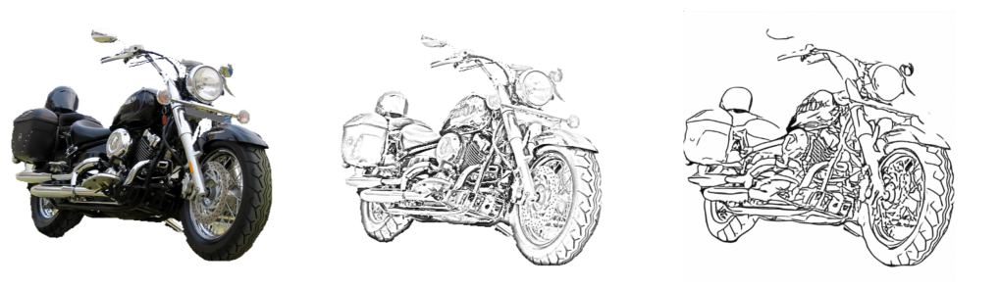
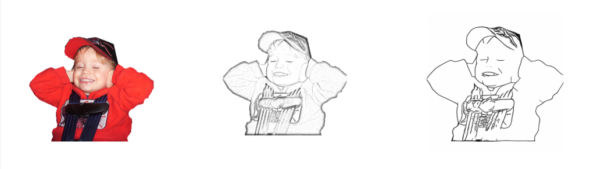
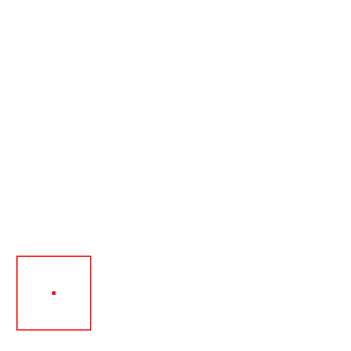
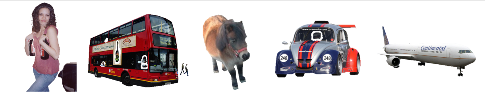
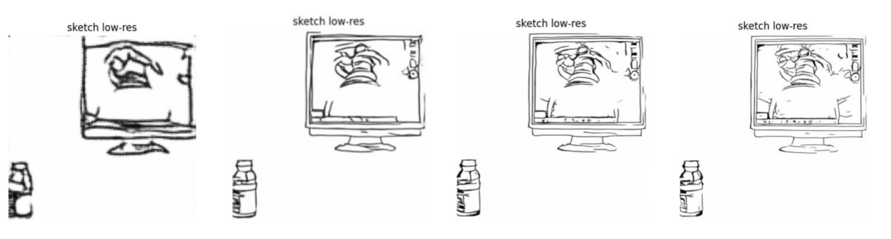

# Sketch Generation

## Description

The goal of this project is to provide enough data sets for high-resolution sketch completion, the work is to convert natural world pictures into a variety of high-resolution sketches (vector format). Finally, multiple sets of "*world pictures* vs *sketches*" image pairs are obtained. In the mean time, a GUI interface is also provided to filter pictures of different quality.

<center class='half'>
    
    
</center>

<center class='half'>
    
    
</center>

**Description (from left to right):** (1) World image (2) Pencil style image (3) Clean line sketch, pixel format (4) Stroke sketch, vector format


## Dependencies

Only some important dependencies are list here

* Tensorflow (1.12.0 <= version <= 1.15.0)

* PyTorch 

* OpenCV

* gizeh

  

## Pipeline

### 0) Preparation

I used the [PASCAL VOC 2012](https://paperswithcode.com/dataset/pascal-voc) data set, because it has segmentation file, so the foreground objects can be intercepted directly. Preparatory work includes cutting the object, enlarging the object, adjusting the image aspect ratio, etc. Here are some object images after cropped, whose backgrounds are all set to white.

<figure>
    
</figure>


### 1) Image 2 Pencil

This step is achieved through image processing, see the code in [pencilize.py](image2pencil/pencilize.py) or [pencilize_batch.py](image2pencil/pencilize_batch.py). The main process are 

* 1) make the subtraction between the original gray image and the image of the inverse gray image after Gaussian blur.

* 2) Gamma enhancement, to increase the contrast of the black part of the pencil drawing

### 2) Pencil 2 Sketch

This function is done with the help of the work [master sketching](https://esslab.jp/~ess/en/research/sketch_master/) done by *Simo-Serra et al.*, please see the [sketch_simplification](sketch_simplification/) folder for more details. This part requires the PyTorch library.

By changing the size of the image input into the network can play a role in controlling the detail level of the output sketch. The smaller the input image, the simpler the output sketch line. Similarly, the larger the input image, the more detailed the sketch, as shown below.

<figure>
    
</figure>
**Description:** The corresponding input image sizes from left to right are 120x, 360x, 600x, 800x

### 3) Sketch 2 Stroke

This part is achieved with the help of the project [virtual_sketching](https://github.com/MarkMoHR/virtual_sketching) (Mo et al.), which requires TensorFlow library. 

Each generation is random, and you can roughly get slightly different stroke sketches through multiple runs.


## Usage

### Model Preparation

1. First, download the pre-trained model of "sketch simplification" (i.e., pencil 2 sketch step)

```
cd sketch_simplification
bash download_models.sh
cd ..
```

​	(It only needs *"model_mse.t7"* model, so you can delete other ones after download)

2. Second, download the pre-trained model for "virtual_sketching" (i.e., sketch 2 stroke)

  * download the model from [here](https://drive.google.com/drive/folders/1-hi2cl8joZ6oMOp4yvk_hObJGAK6ELHB)

  * put *pretrain_clean_line_drawings* folder under this [direction](virtual_sketching/model)

### Single Run

After downloading and configuring the above model, you can run the result of one image by typing: (make sure you stay in the project root now)

```
python pipeline.py --voc [the path of VOC dataset on your PC]  --img [image name]
```

(note: please pick up an image with the corresponding segmentation file, and don't write appendix like .png or .jpg)

**example:**

```
python pipeline.py --voc F:/VOCdevkit/VOC2012/ --img 2007_000032
```

**Other parameters:**

If you want to further control the details of the generated sketches, you can also use the following parameters.

```
--kernel (int) "Gaussian blur kernel size in image 2 pencil step"
--gamma  (float)  "Gamma transfer in pencilize process"
--cuda   (bool)  "Manually setting use CUDA or not when doing deep learning"
--vec_num (int)  "the number of generated vector form sketch image"
```

example:

```
python pipeline.py --voc F:/VOCdevkit/VOC2012/ --img 2007_000032 --kernel 15 --gamma 2.0 --cuda True --vec_num 10
```

### Output

The output will be stored in the [data](data/) folder, where [seq_data](data/seq_data) folder inside will store the stroke file in vector form.


## Citation/Acknowledgement 

1) *[virtual_sketching](https://github.com/MarkMoHR/virtual_sketching)*

```
@article{mo2021virtualsketching,
  title   = {General Virtual Sketching Framework for Vector Line Art},
  author  = {Mo, Haoran and Simo-Serra, Edgar and Gao, Chengying and Zou, Changqing and Wang, Ruomei},
  journal = {ACM Transactions on Graphics (Proceedings of ACM SIGGRAPH 2021)},
  year    = {2021},
  volume  = {40},
  number  = {4},
  pages   = {51:1--51:14}
}
```

2) *[sketch_simplification](https://github.com/bobbens/sketch_simplification)*

```
@Article{SimoSerraSIGGRAPH2016,
   author    = {Edgar Simo-Serra and Satoshi Iizuka and Kazuma Sasaki and Hiroshi Ishikawa},
   title     = {{Learning to Simplify: Fully Convolutional Networks for Rough Sketch Cleanup}},
   journal   = "ACM Transactions on Graphics (SIGGRAPH)",
   year      = 2016,
   volume    = 35,
   number    = 4,
}
```

and

```
@Article{SimoSerraTOG2018,
   author    = {Edgar Simo-Serra and Satoshi Iizuka and Hiroshi Ishikawa},
   title     = {{Mastering Sketching: Adversarial Augmentation for Structured Prediction}},
   journal   = "ACM Transactions on Graphics (TOG)",
   year      = 2018,
   volume    = 37,
   number    = 1,
}
```

